# Slate Integration Setup

This guide explains how to configure Slate so Scholaro can send documents directly into your Slate instance.

The setup consists of four parts:

1. Create a service account in Slate
2. Create a source format in Slate
3. Configure the webhook in Scholaro
4. Remap the source format after the first file is received

## Related Slate documentation

- [User Accounts](https://knowledge.technolutions.com/hc/en-us/articles/360026832392-User-Accounts#types-0-0)
- [Importing Data with Web Services](https://knowledge.technolutions.com/hc/en-us/articles/360033201452-Importing-Data-with-Web-Services#pull-data-from-a-web-service-into-slate-0-0)
- [Creating a Custom Source Format](https://knowledge.technolutions.com/hc/en-us/articles/360033287711-Creating-a-Custom-Source-Format)
- [Upload Dataset Stages](https://knowledge.technolutions.com/hc/en-us/articles/360033699511)

---

## 1. Create the service account in Slate

In Slate, go to **Database -> User Permissions**.

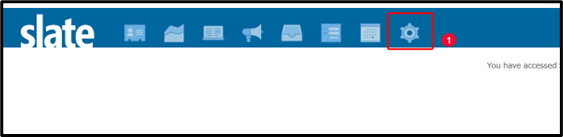

If needed, continue into the user permissions area.

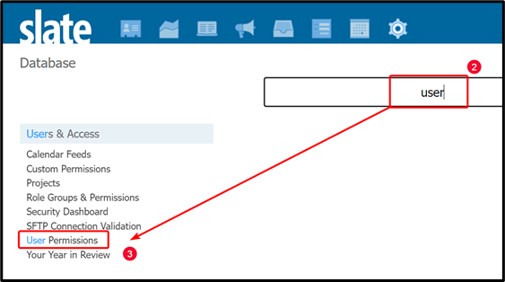

Click **New User**.

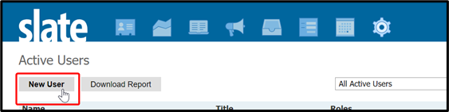

Create the service account with the following values:

- **First Name**: Scholaro
- **Last Name**: Service Account
- **Email**: Use a monitored email address that your team can access. You will use this same email again later.
- **User Type**: Service Account
- **User ID**: scholaro
- **Password**: Use a strong password and store it securely. You will need it again for the webhook configuration.

Example service account form:

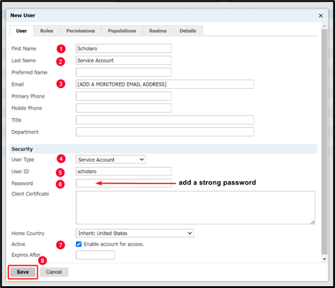

!!! warning
    Save the email address and password in a secure place. You will need both when configuring the webhook in Scholaro.

---

## 2. Create the source format in Slate

In Slate, go to **Database -> Source Formats**.

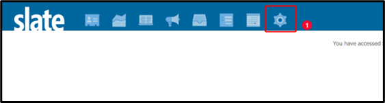

Continue into the Source Formats area if needed.

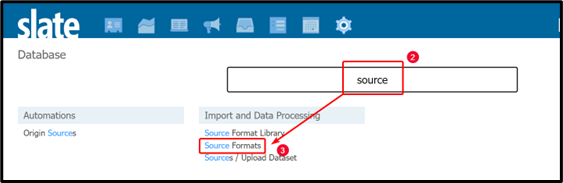

Click **New Source Format**.

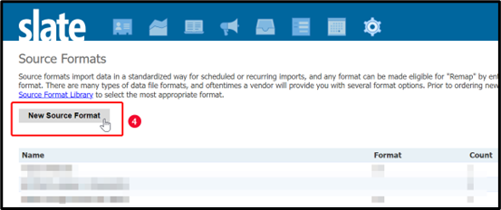

### General tab

On the **General** tab, enter the following values. Do **not** click **Save** yet.

- **Status**: Active
- **Name**: Scholar DIP
- **Format**: DIP
- **Type**: One-Time / Differential
- **Remap As Of Date**: Today's date in `yyyy-MM-dd` format
- **Remap Active**: Inactive
- **Scope**: Person/Dataset Record
- **Dataset**: Person/Application Records
- **Unsafe**: Unsafe
- **Hide**: Create Source Interactions
- **Disable Update Queue**: Allow records to enter update queue upon import (allow rules to fire)
- **Update Only**: Allow record creation
- **Dedupe Records**: Enable record creation for all rows
- **Notification**: Failures only
- **Notification Email**: Use the same monitored email address used for the service account
- **Read Permission**: Optional
- **Upload/Build Permission**: Optional
- **Source Metadata**: Optional

!!! note
    You may set **Notification** to **Successes and Failures** if you want to receive an email every time the import runs.

Example of the General tab:

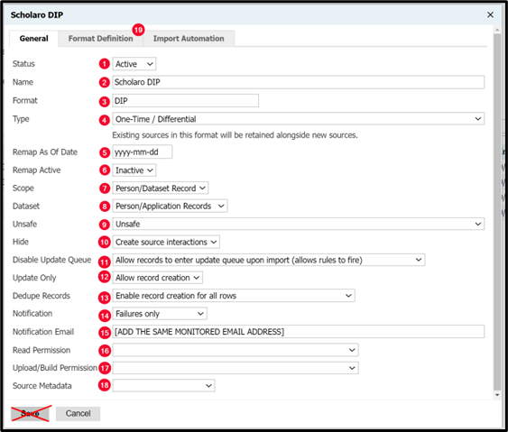

If you already clicked **Save**, that is fine. Open the source format again and click **Edit** to continue.

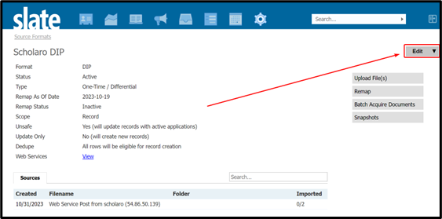

### Format Definition tab

Go to the **Format Definition** tab and enter the following XML, then click **Save**.

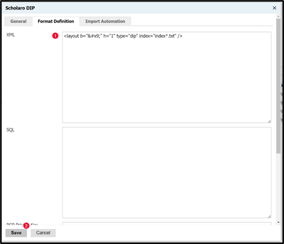

```xml
<layout b="&#x9;" h="1" type="dip" index="index*.txt" />

After saving, open the **Web Services** menu for the source format and locate the **Standard POST URL**.

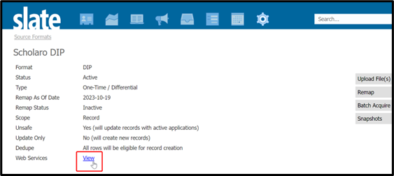

If your screen shows an alternate view, use the **Standard POST URL** shown there.

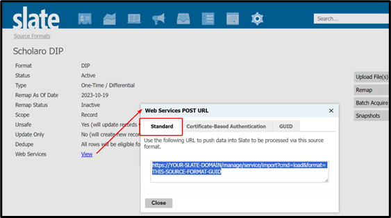

!!! tip
    Copy the **Standard POST URL** somewhere safe. You will enter it in Scholaro in the next section.

## 3. Configure the webhook in Scholaro

Log in to the Scholaro webhook page:

`https://www.scholaro.com/app/developer/webhooks`

Enter the following values:

- **URL**: Paste the **Standard POST URL** from the Slate source format
- **Events to send**: `evaluation_report.created`
- **Authentication**: Use basic authentication
  - **Username**: `scholaro`
  - **Password**: The service account password you created in Slate
- **Enabled**: Checked

Example webhook configuration:

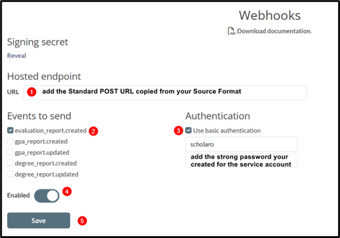

Once saved, Scholaro will be able to send ZIP files into your Slate instance.

## 4. Remap the source format after the first file is received

After Scholaro sends the first ZIP file, return to the **Scholar DIP** source format in Slate.

You should see a successful web service post from `scholaro`. Once the file is ready for mapping, Slate will show imported rows and the **Remap** option will become available.

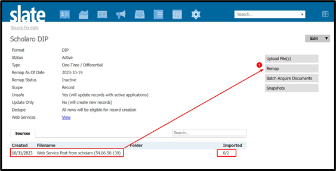

### Field mappings

Click **Remap** and configure the following field mappings:

- `first` -> **Record > First Name**
- `last` -> **Record > Last Name**
- `email` -> **Record > Email**
- `type` -> **Material > Material Code**
- `Filename` -> **Material > Material Filename**

Example field mappings screen:

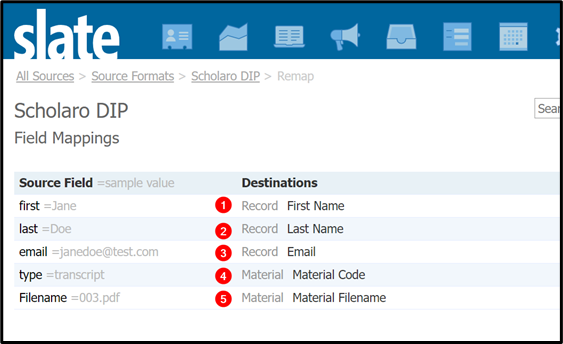

### Prompt value mappings

Go to the **Prompt Value Mappings** screen and select the `type` source field.

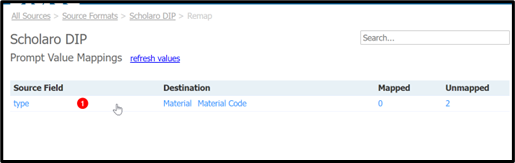

Map the incoming document types to the correct **Material Types** in your Slate instance, then save.

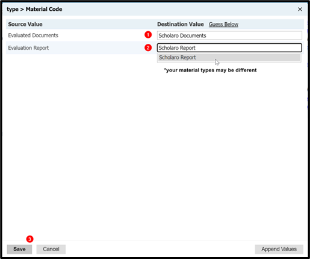

When finished, return to the source format.

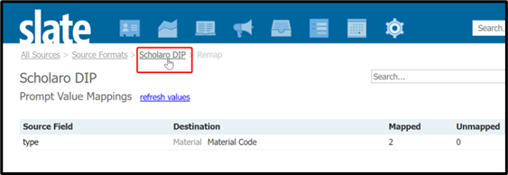

### Activate remap

Open the source format and click **Edit**.


Set **Remap Active** to **Active**, then click **Save**.

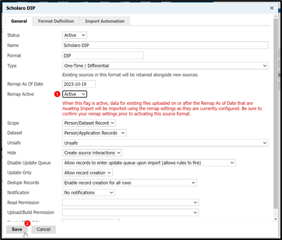

At that point, the source format should be fully configured for ongoing imports.

## Summary

To complete the integration successfully:

- Create a Slate service account for Scholaro
- Create the **Scholar DIP** source format
- Use the source format's **Standard POST URL** in the Scholaro webhook
- Wait for the first ZIP file to arrive
- Complete field and prompt mappings
- Set **Remap Active** to **Active**

Once these steps are complete, Scholaro can send supported files directly into your Slate environment.