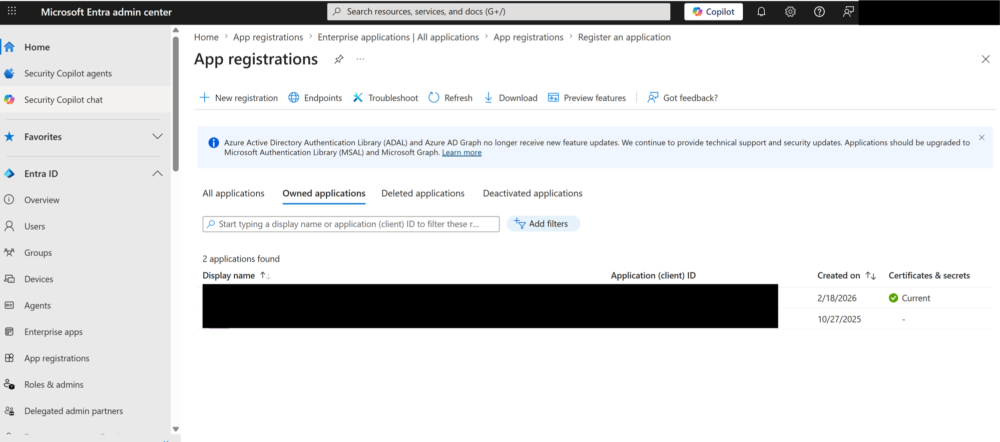
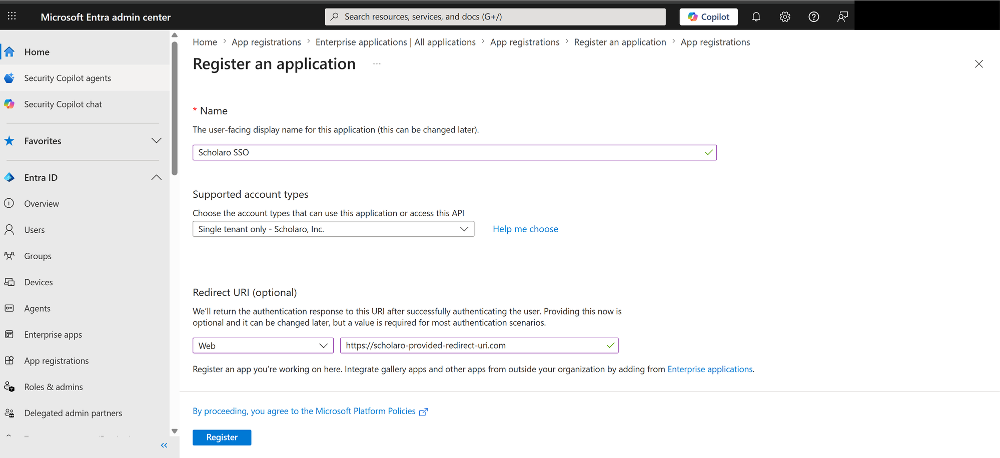
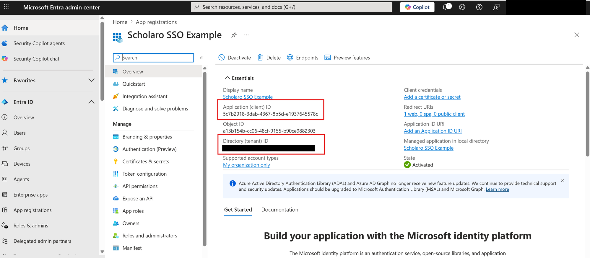
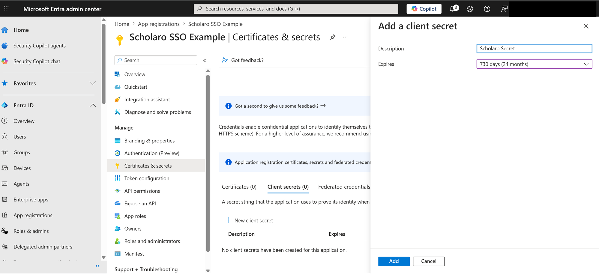
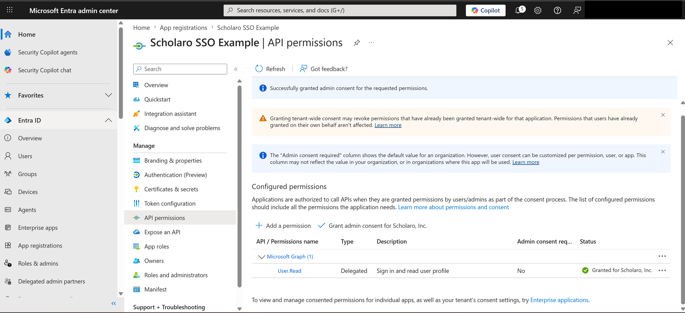

# Microsoft Entra ID SSO Setup

This guide explains how to connect **Microsoft Entra ID** (formerly Azure AD / Microsoft 365) to Scholaro using OpenID Connect (OIDC).

Before you start, read the [SSO overview](../sso.md) for how the managed setup process works.

## Prerequisites

- An administrator account in the [Microsoft Entra admin center](https://entra.microsoft.com).
- The **Redirect URI** Scholaro provided for your connection. It looks like:

    `https://www.scholaro.com/login/sso/<your-connection>/callback`

!!! note
    Use the exact Redirect URI Scholaro gave you — the example above is illustrative.

---

## 1. Register an application

In the Microsoft Entra admin center, open **Entra ID -> App registrations** (or type *App registrations* in the top search bar).

Click **New registration**, then enter:

- **Name**: `Scholaro SSO` (or any name your team will recognize).
- **Supported account types**: *Single tenant only* (accounts in your organization only).
- **Redirect URI**: select **Web** and paste the Redirect URI Scholaro provided.

Click **Register**.

---

## 2. Copy the application and tenant IDs

On the application's **Overview** page, copy:

- **Application (client) ID**
- **Directory (tenant) ID**

You will send both to Scholaro.

---

## 3. Create a client secret

Go to **Certificates & secrets -> Client secrets** and click **New client secret**.

- **Description**: `Scholaro Secret`
- **Expires**: choose your organization's preferred lifetime (for example, 730 days / 24 months).

Click **Add**, then copy the secret **Value** immediately.

!!! warning
    The secret **Value** is shown only once. Copy it now and send it to Scholaro through a secure channel — you cannot retrieve it again after leaving this page.

!!! warning "Renew the secret before it expires"
    Client secrets expire on the date you chose. **When this secret expires, SSO sign-in will stop working** until a new one is in place. Before the expiry date, create a new client secret and send the new value to Scholaro so there is no interruption to sign-in.

---

## 4. Grant admin consent

Open **API permissions**. A new app registration already includes the **Microsoft Graph -> User.Read** (delegated) permission, which is all Scholaro needs — **you do not need to add any permissions**. Scholaro requests the standard OpenID Connect scopes (`openid`, `profile`, `email`, and `offline_access`) at sign-in.

Click **Grant admin consent for &lt;your organization&gt;** and confirm. This pre-approves those scopes for all users so they are not individually prompted on first sign-in — and it is required if your tenant has user consent disabled. The **Status** column then shows a green "Granted" check.

---

## 5. Send Scholaro your connection details

Provide the following to your Scholaro representative:

| Value | Where to find it |
| --- | --- |
| Authority / Issuer URL | `https://login.microsoftonline.com/<tenant-id>/v2.0` |
| Application (client) ID | App registration -> Overview |
| Client secret | The value copied in step 3 |
| Email domain(s) | Your organization's email domain, e.g. `university.edu` |

Scholaro enables the connection and confirms when it is ready.

---

## 6. Test sign-in

Go to the Scholaro sign-in page, enter an email address in your domain, and confirm you are redirected to Microsoft to authenticate and returned to Scholaro signed in.

!!! tip
    If sign-in fails, double-check that the Redirect URI in Entra exactly matches the one Scholaro provided (including `https://` and no trailing-slash differences).
