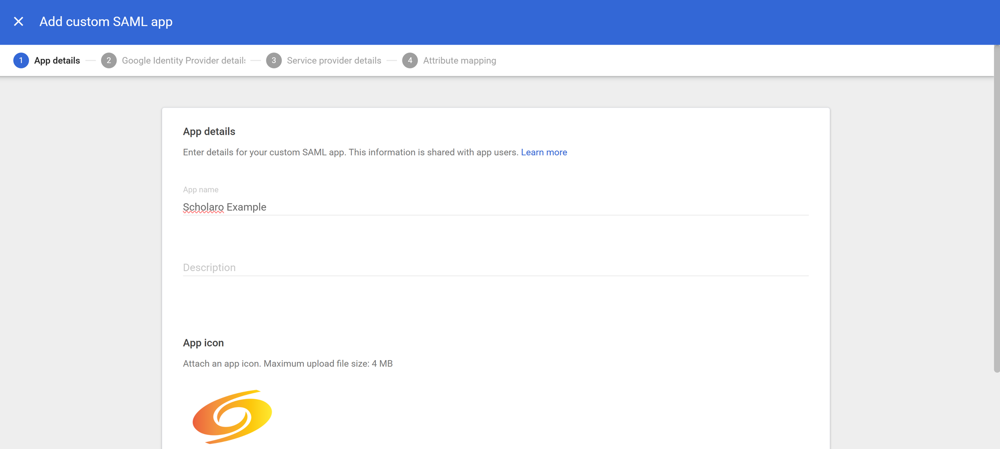
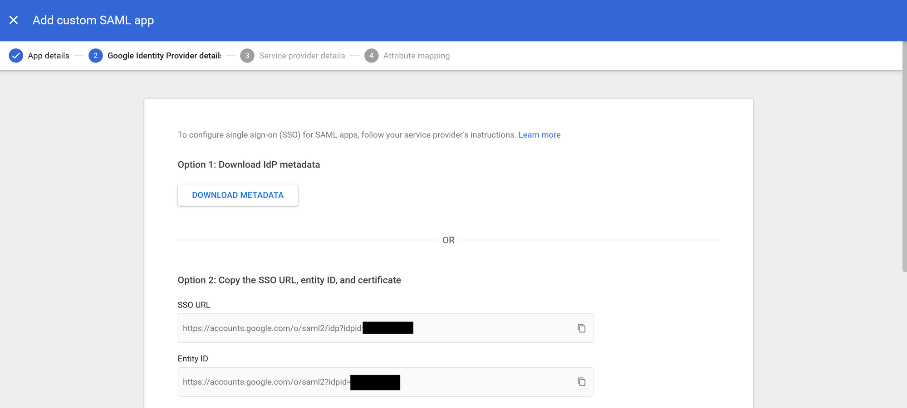
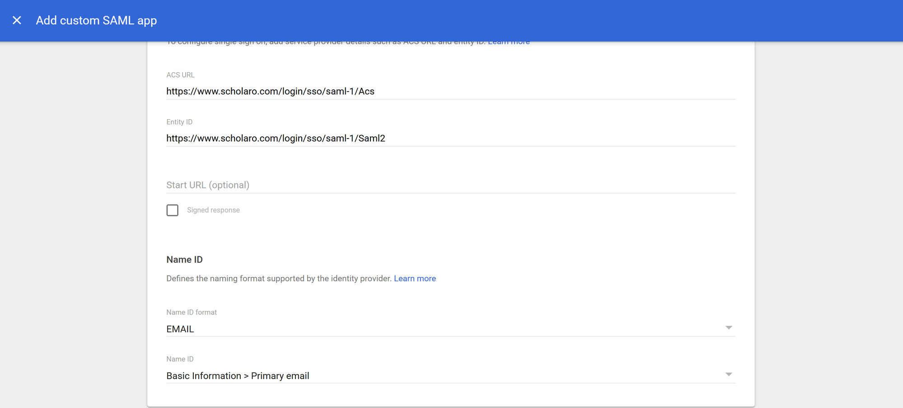
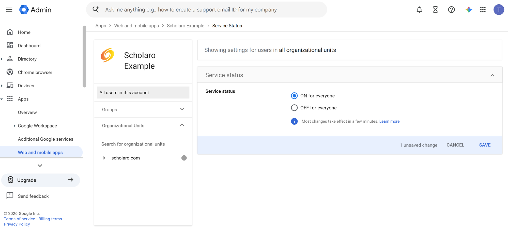

# Google Workspace SSO Setup

This guide explains how to connect **Google Workspace** to Scholaro using a custom SAML application — the standard way to set up SSO for a third-party app in the Google Admin console.

Before you start, read the [SSO overview](../sso.md) for how the managed setup process works.

## Prerequisites

- A **super administrator** account for your Google Workspace domain ([admin.google.com](https://admin.google.com)).
- The **ACS URL** and **SP Entity ID** Scholaro provided for your connection. They look like:

    - ACS URL: `https://www.scholaro.com/login/sso/<your-connection>/Acs`
    - SP Entity ID: `https://www.scholaro.com/login/sso/<your-connection>/Saml2`

!!! note
    Use the exact ACS URL and Entity ID Scholaro gave you — the examples above are illustrative.

---

## 1. Create a custom SAML app

In the Google Admin console, go to **Apps -> Web and mobile apps**, click **Add app**, then **Add custom SAML app**.

- **App name**: `Scholaro`
- (Optional) upload an app icon.

Click **Continue**.

---

## 2. Copy Google's identity provider details

On the **Google Identity Provider details** step, **download the IdP metadata** (recommended) and note the values Scholaro will need:

- **SSO URL**
- **Entity ID**
- **Certificate** (included in the metadata download)

Click **Continue**.

---

## 3. Enter Scholaro's service-provider details

On the **Service provider details** step, enter the values Scholaro provided:

- **ACS URL**: the ACS URL from Scholaro.
- **Entity ID**: the SP Entity ID from Scholaro.
- **Name ID format**: `EMAIL`.
- **Name ID**: *Basic Information > Primary email*.

Click **Continue**.

---

## 4. Map attributes (optional)

On the **Attributes** step you can map Google directory fields to the claims Scholaro reads, for example:

- *Primary email* -> `email`
- *First name* / *Last name* -> `name`

The user's email is already carried by the Name ID, so attribute mapping is usually optional. Click **Finish**.

---

## 5. Turn the app on

A new app is **OFF for everyone** by default. Open the app, click **User access**, and turn it **ON** for the organizational units (or groups) whose members should use Scholaro SSO. Save.

!!! note
    Changes to user access can take a few minutes to propagate in Google Workspace.

---

## 6. Send Scholaro your connection details

Provide the following to your Scholaro representative:

| Value | Where to find it |
| --- | --- |
| IdP metadata URL or metadata XML | Downloaded in step 2 |
| IdP Entity ID | Google Identity Provider details (step 2) |
| Email domain(s) | Your Workspace domain, e.g. `university.edu` |

Scholaro enables the connection and confirms when it is ready.

---

## 7. Test sign-in

Go to the Scholaro sign-in page, enter an email address in your domain, and confirm you are redirected to Google to authenticate and returned to Scholaro signed in.

!!! tip
    If sign-in fails, confirm the app is turned **ON** for the test user's organizational unit and that the ACS URL and Entity ID exactly match the values Scholaro provided.
