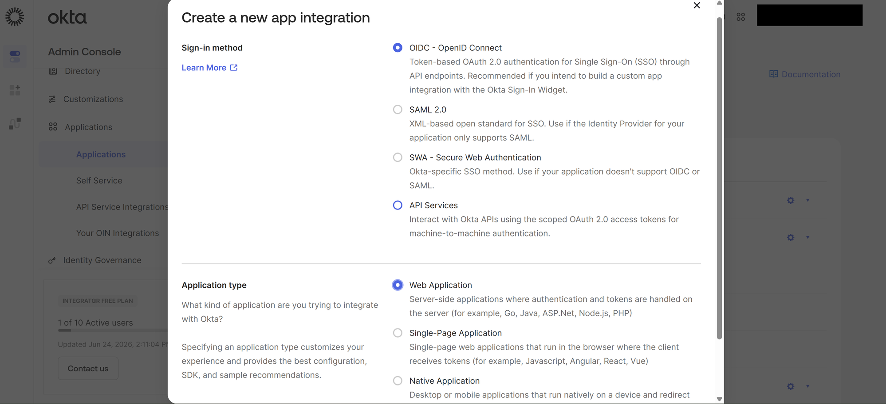
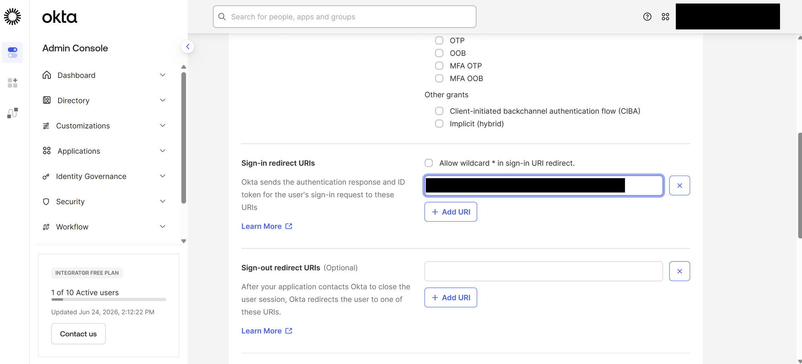
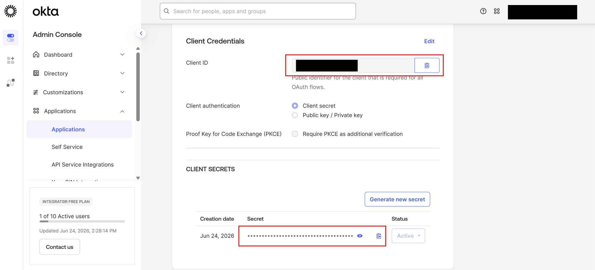

# Okta SSO Setup

This guide explains how to connect **Okta** to Scholaro using OpenID Connect (OIDC).

Before you start, read the [SSO overview](../sso.md) for how the managed setup process works.

## Prerequisites

- Administrator access to your Okta org (the Admin Console, e.g. `https://<your-org>-admin.okta.com`).
- The **Redirect URI** Scholaro provided for your connection. It looks like:

    `https://www.scholaro.com/login/sso/<your-connection>/callback`

!!! note
    Use the exact Redirect URI Scholaro gave you — the example above is illustrative.

---

## 1. Create an OIDC app integration

In the Okta Admin Console, go to **Applications -> Applications** and click **Create App Integration**.

- **Sign-in method**: *OIDC - OpenID Connect*
- **Application type**: *Web Application*

Click **Next**.

---

## 2. Configure the app

On the **New Web App Integration** screen:

- **App integration name**: `Scholaro SSO` (or any name your team will recognize).
- **Grant type**: leave **Authorization Code** selected.
- **Sign-in redirect URIs**: paste the Redirect URI Scholaro provided.

Under **Assignments**, choose who can use the app — for example *Allow everyone in your organization to access*, or limit it to specific groups.

Click **Save**.

---

## 3. Copy the client credentials

On the application's **General** tab, copy:

- **Client ID**
- **Client secret**

!!! warning
    Send the client secret to Scholaro through a secure channel.

---

## 4. Confirm your issuer URL

Your Okta **issuer** is your org URL, for example `https://<your-org>.okta.com`. You can confirm it by opening `https://<your-org>.okta.com/.well-known/openid-configuration` and reading the `issuer` value.

!!! note
    Scholaro requests the standard OpenID Connect scopes (`openid`, `profile`, `email`, and `offline_access`), which Okta grants to OIDC apps by default — there is nothing extra to configure.

---

## 5. Send Scholaro your connection details

Provide the following to your Scholaro representative:

| Value | Where to find it |
| --- | --- |
| Issuer / Authority URL | `https://<your-org>.okta.com` |
| Client ID | Application -> General tab |
| Client secret | Application -> General tab |
| Email domain(s) | Your organization's email domain, e.g. `university.edu` |

Scholaro enables the connection and confirms when it is ready.

---

## 6. Test sign-in

Go to the Scholaro sign-in page, enter an email address in your domain, and confirm you are redirected to Okta to authenticate and returned to Scholaro signed in.

!!! tip
    If sign-in fails, double-check that the Sign-in redirect URI in Okta exactly matches the one Scholaro provided, and that your test user is assigned to the app.
